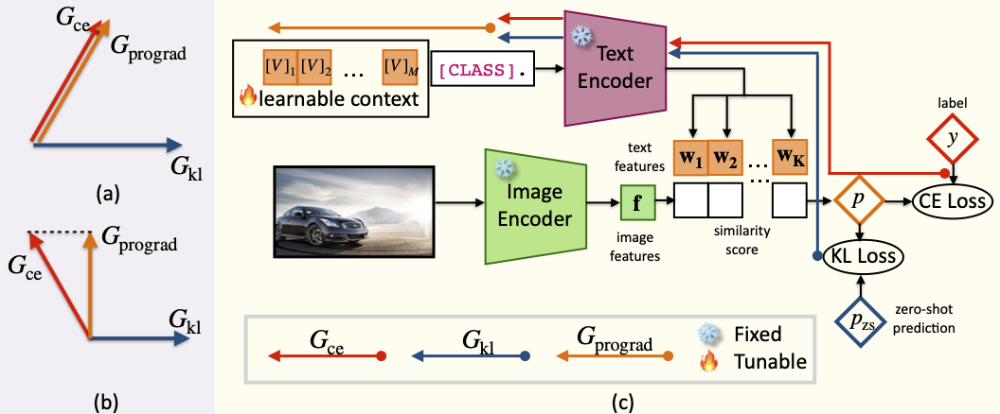

# [ICCV23] Prompt-aligned Gradient for Prompt Tuning

We present Prompt-aligned Gradient, dubbed ProGrad, to prevent prompt tuning from forgetting the the general knowledge learned from VLMs. In particular, ProGrad only updates the prompt whose gradient is aligned (or non-conflicting) to the “general direction”, which is represented as the gradient of the KL loss of the pre-defined prompt prediction. Extensive experiments demonstrate the stronger few-shot generalization ability of ProGrad over state-of-the-art prompt tuning methods. 



[[paper link]](https://doi.org/10.48550/arxiv.2205.14865)

The codes are organized into two folders:

1. [Dassl.ProGrad.pytorch](Dassl.ProGrad.pytorch/) is the modified toolbox of [Dassl.pytorch](https://github.com/KaiyangZhou/Dassl.pytorch).
2. [ProGrad.public](ProGrad.public/). To get the results in our paper, follow the [README.md](ProGrad.public/README.md) under [ProGrad.public/](ProGrad.public/) to set the environment.

## Citation

If you find our paper or this project helps your research, please kindly consider citing our paper in your publication.

```
@inproceedings{https://doi.org/10.48550/arxiv.2205.14865,
  author = {Zhu, Beier and Niu, Yulei and Han, Yucheng and Wu, Yue and Zhang, Hanwang},
  title = {Prompt-aligned Gradient for Prompt Tuning},
  publisher = {International Conference on Computer Vision},
  year = {2023},
}

```

## Acknowledgement
Our codes are built on top of [CoOp](https://github.com/KaiyangZhou/CoOp) and [Dassl](https://github.com/KaiyangZhou/Dassl.pytorch).
